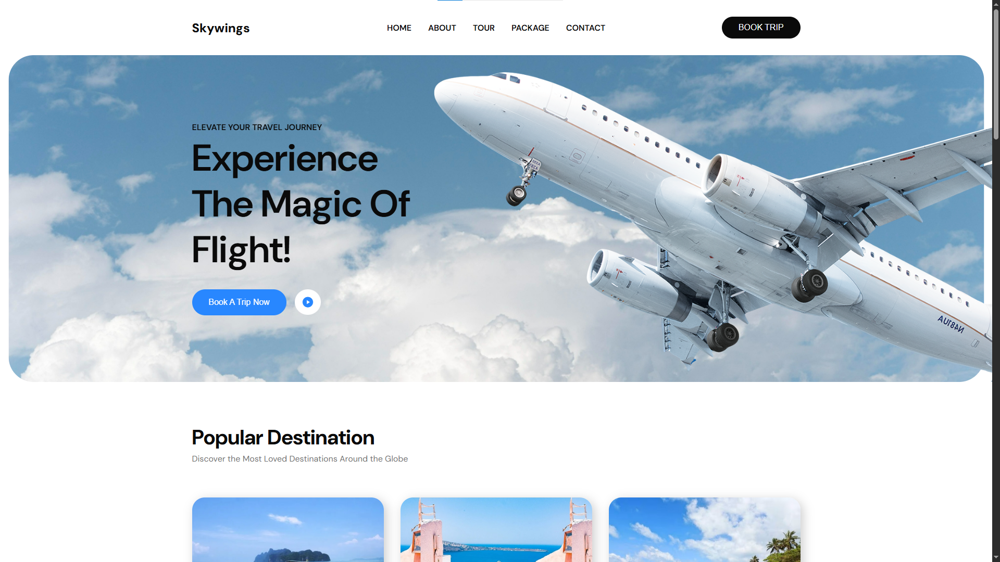
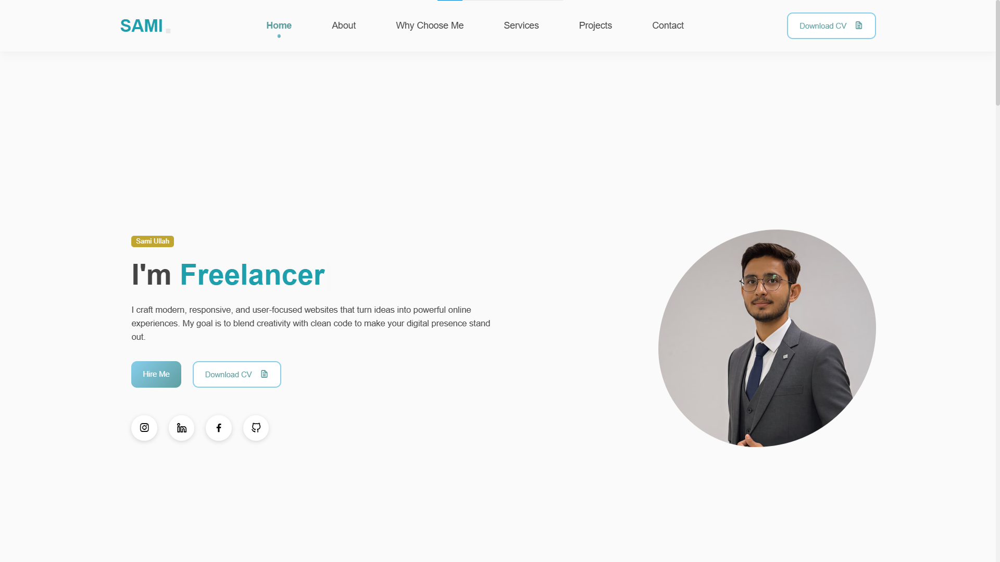
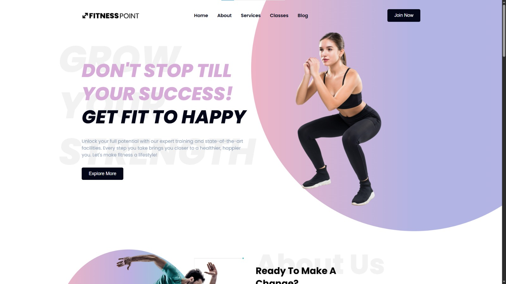
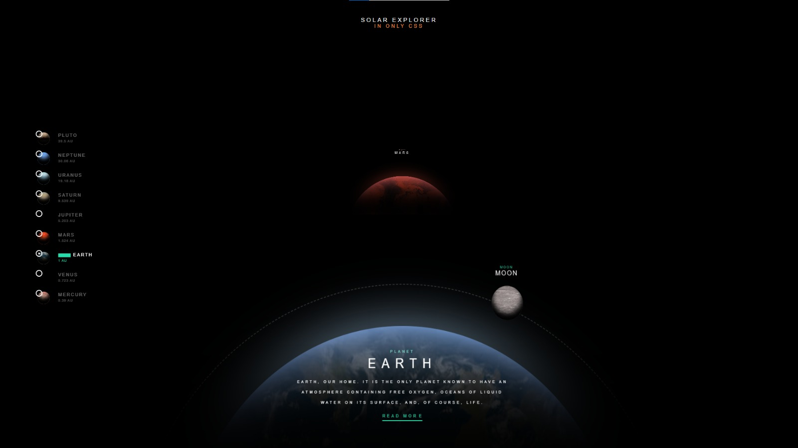

<!-- ================= PROFILE HEADER ================= -->

  

<h1 align="center">Hey 👋 What's up?</h1>

  
  
  
  
  
  

 
<!-- ================= ABOUT ================= -->

Hi, I'm <b>Muhammad Sami Ullah</b> — a passionate Freelance <b>Web Developer & Designer</b> specializing in <b>WordPress</b>, <b>Shopify</b>, and <b>custom-coded</b> websites.  
I create fast, responsive, and SEO-friendly websites that help brands stand out and turn visitors into loyal customers.  

Whether you need a modern business site or a high-converting eCommerce store, I deliver clean code, pixel-perfect design, and seamless user experiences.  
Let’s work together to bring your vision online and grow your digital presence 🚀

<!-- ================= SKILLS & TECHNOLOGIES ================= -->
<h3 align="center">Skills & Technologies</h3>
 

  <!-- Highlight WordPress & Shopify first -->
  
  
  
  
  
  
  
  
  
  
  
  
  
  
  
  
  
  
  
  
  

<!-- ================= TOOLS ================= -->
<h3 align="center">Tools I Use</h3>
 

  
  
  
  
  
  
  
  
  
  
  
  
  
  
  

<!-- ================= TOP PROJECTS ================= -->
<h3 align="center">Top Projects</h3>
 
<table align="center" style="width:100%; max-width:900px; border-spacing:20px;">
  <tr>
    <td align="center" style="padding:0; width:50%;">
      <a href="https://github.com/sami-ullah-2004/SolarSystem" style="text-decoration:none;">
        

          
          <h4 style="margin:5px 0; font-size:16px; color:white;">Solar System</h4>
          
Sleek travel page for SkyWings built with HTML & CSS showcasing destinations.

        

      </a>
    </td>

  <td align="center" style="padding:0; width:50%;">
      <a href="https://github.com/sami-ullah-2004/FitnessPoint" style="text-decoration:none;">
        

          
          <h4 style="margin:5px 0; font-size:16px; color:white;">Sami Ullah Portfolio</h4>
          
Portfolio website showcasing skills, projects & contact info.

        

      </a>
    </td>
  </tr>

  <tr>
    <td align="center" style="padding:0; width:50%;">
      <a href="https://github.com/sami-ullah-2004/AnotherRepo1" style="text-decoration:none;">
        

          
          <h4 style="margin:5px 0; font-size:16px; color:white;">FitnessPoint</h4>
          
Modern fitness website built with HTML & CSS showcasing services and trainers.

        

      </a>
    </td>

   <td align="center" style="padding:0; width:50%;">
      <a href="https://github.com/sami-ullah-2004/AnotherRepo2" style="text-decoration:none;">
        

          
          <h4 style="margin:5px 0; font-size:16px; color:white;">Solar System Explorer</h4>
          
Interactive CSS-only Solar System explorer showcasing planets and their details.

        

      </a>
    </td>
  </tr>
</table>

<!-- ================= CALL TO ACTION ================= -->
<h3 align="center">✨ Let's Build Something Great Together!</h3>

Feel free to reach out to me. I’m always open to new opportunities and collaborations.

